# VetStudy AI: финальное техническое задание

Дата версии: 2026-05-02

## 1. Итоговое решение

Делаем не просто Telegram-бота, а личную учебно-клиническую AI-систему для ветеринарии.

Финальный выбор:

- Основной интерфейс: приватная Telegram-супергруппа с включенными Forum Topics.
- Каждый Telegram topic является учебной папкой: `Фармакология`, `Хирургия`, `ВНБ`, `Паразитология`, `Анатомия`, `Диагностика`, `Клинические случаи`, `Экзамен`.
- Бот отвечает в том же topic, сохраняет вопрос, ответ, теги, резюме, связанные темы и embedding.
- Долгая память строится не на бесконечном чате, а на базе данных, резюме тредов и семантическом поиске.
- В MVP делаем Telegram-first. Веб-кабинет закладываем архитектурно, но не строим первым.

Оценка итогового решения: 96/100.

Почему не чистый ChatGPT/Claude/Gemini Projects: не хватает управляемой памяти, папок, Telegram UX, поиска, экспорта, статистики и правил безопасности.

Почему не только n8n/Dify: это хороший быстрый прототип, но хуже как законченный продукт с будущей админкой, подписками, точной логикой дозировок, тестами и кастомной базой.

Почему кастомный Python backend: максимальный контроль, нормальная база, нормальные тесты, понятный рост до продукта.

## 2. Что берем из ответов других AI

Берем:

- Telegram Forum Topics как нативную модель папок.
- Единый AI Router с несколькими провайдерами и fallback.
- Дешевую основную модель, быстрые модели для классификации, сильную модель для сложных вопросов.
- Идею векторной памяти, но вместо ChromaDB/Qdrant в MVP используем PostgreSQL + pgvector.
- Экспорт в Markdown/Anki.
- Голосовые, фото, OCR и загрузку PDF как этап 2.
- Режимы ответа: кратко, глубже, экзамен, практический протокол.
- Кнопки под ответом: сохранить, углубить, проверить источниками, карточки, тест, перенести.

Отбрасываем:

- Обещание "полностью бесплатно, стабильно и умно". Бесплатные лимиты меняются, поэтому нужен fallback и лимит расходов.
- Только no-code как финальную архитектуру.
- Хранение истории в JSON-файлах.
- Слепое добавление последних 20 сообщений без RAG и резюме.
- Уверенные дозировки без вида, массы, состояния и источника.
- Жесткую привязку к одному провайдеру или конкретному названию модели.

## 3. Главный пользовательский сценарий

1. Пользователь открывает приватную Telegram-группу.
2. Заходит в topic `Фармакология`.
3. Пишет: `атропин у кошки, когда применяют и чего бояться`.
4. Бот определяет контекст topic, находит прошлые обсуждения по атропину/антихолинергикам, добавляет релевантную память.
5. Если вопрос связан с дозировкой, бот проверяет, хватает ли данных: вид, масса, возраст, показание, путь введения, форма препарата, сопутствующие болезни, другие препараты.
6. Бот отвечает структурно и практично.
7. Под ответом есть кнопки: `Сохранить`, `Глубже`, `Проверить источниками`, `Карточки`, `Тест`, `Связанные темы`.
8. Позже пользователь пишет: `найди, что мы обсуждали по НПВС у кошек`, и бот ищет по смыслу, а не только по словам.

## 4. Стек MVP

Backend:

- Python 3.12+
- aiogram 3 для Telegram Bot API
- FastAPI для webhook, healthcheck и будущего API веб-кабинета
- SQLAlchemy 2 + Alembic
- PostgreSQL 16+
- pgvector для semantic search
- Redis + RQ или Celery для фоновых задач после MVP
- Docker Compose

Инфраструктура:

- MVP 0 USD: Supabase Free для PostgreSQL/Storage + Render/Railway/Fly free/low-cost для backend, если лимитов хватит.
- Стабильный режим: небольшой VPS или Railway/Fly paid + Supabase.
- Обязательное условие: ежедневный backup базы.

AI layer:

- `LLMRouter`, не прямые вызовы моделей из handlers.
- Основная экономичная модель: Gemini Flash-класс или аналог.
- Классификация/теги/резюме: самая дешевая быстрая модель.
- Глубокий режим: более сильная модель, например OpenAI GPT-5.4/5.5-класс, Claude/Gemini Pro-класс или доступный аналог через OpenRouter.
- Fallback: Groq/OpenRouter free или low-cost модели.
- Все названия моделей хранятся в `.env`/конфиге, не зашиваются в код.

Примечание по актуальности: Google указывает, что лимиты Gemini зависят от проекта, tier и модели, а фактическая емкость может меняться. Поэтому нельзя проектировать систему как "навсегда бесплатную".

## 5. Режимы ответа

По умолчанию: `Практический`.

Режимы:

- `Кратко`: 5-10 строк, только суть.
- `Практический`: что делать, на что обратить внимание, типичные ошибки.
- `Глубоко`: механизмы, патогенез, связи с другими темами.
- `Экзамен`: определения, классификации, что часто спрашивают.
- `Протокол`: пошаговый алгоритм для клинического случая.
- `Карточки`: генерация вопросов-ответов для повторения.
- `Тест`: 5-10 вопросов с ответами и объяснениями.

Команды:

- `/mode practical`
- `/mode short`
- `/mode deep`
- `/mode exam`
- `/mode protocol`

## 6. Формат ответа по фармакологии

Базовый шаблон:

```text
[Краткий вывод]

Когда применяют
- ...

Механизм
- ...

Ключевые риски
- ...

Кошки и собаки
- Видовые особенности.
- Что особенно проверить перед назначением.

Дозировки
- Если данных достаточно и есть источник: дать дозу с единицами, путем введения, кратностью, длительностью и оговоркой о проверке по актуальной инструкции/формуляру.
- Если данных недостаточно: не угадывать, а запросить недостающие данные.

Взаимодействия
- ...

Практические ошибки
- ...

Что запомнить
- 3-5 пунктов.

Связанные темы
- [внутренние ссылки/команды поиска]
```

Для сравнений обязательна таблица.

Для клинического вопроса обязательны:

- вид животного;
- масса;
- возраст;
- пол/кастрация;
- жалобы;
- длительность;
- диагноз или рабочая гипотеза;
- текущие препараты;
- беременность/лактация;
- печень/почки/сердце;
- форма препарата и концентрация.

Если вопрос срочный или опасный, бот отвечает как учебный ассистент и явно рекомендует очную ветеринарную оценку.

## 7. Правила безопасности для ветеринарии

Система не должна изображать лицензированный справочник дозировок.

Жесткие правила:

- Не давать уверенную дозировку, если не указан вид и масса.
- Не давать уверенную дозировку, если не указана лекарственная форма/концентрация, когда это влияет на расчет.
- Для кошек всегда проверять видовую токсичность и противопоказания.
- Для собак всегда уточнять породу/мутации/особые риски, если это релевантно препарату.
- Для пищевых животных в будущем обязательно указывать withdrawal time и страну регулирования.
- Если источника нет, писать: `Дозировка требует проверки по актуальной инструкции/формуляру`.
- Для extra-label использования: помечать как extra-label и требующее решения ветеринарного врача.
- При противоречии источников: не выбирать самоуверенно, а показать расхождение.

Минимальные надежные источники на этап "Проверить источниками":

- Merck Veterinary Manual.
- FDA Animal Drugs / Green Book для США.
- EMA/локальные инструкции для Европы, если добавим регион.
- Plumb's/VIN/BSAVA, если у пользователя есть доступ.
- Загруженные пользователем лекции/формуляры, если они есть.

## 8. Память

Нужны 5 уровней памяти:

1. Профиль пользователя:
   - русский язык;
   - ветеринарный специалист после университета;
   - цель: реальная ежедневная практика с кошками и собаками;
   - стиль: практично, точно, с примерами, без лишней воды.

2. Память предмета:
   - для фармакологии один шаблон;
   - для хирургии другой;
   - для ВНБ третий.

3. Память topic:
   - что уже обсуждали в конкретной папке;
   - текущие слабые места;
   - сжатое резюме topic.

4. Семантическая память:
   - embeddings сообщений, заметок, карточек, документов.

5. Клиническая память:
   - отдельные кейсы животных, не в MVP-1, но заложить таблицы.

Алгоритм ответа:

1. Получить сообщение и `message_thread_id`.
2. Найти topic.
3. Определить intent: вопрос, поиск, дозировка, клинический кейс, карточки, тест, команда.
4. Найти релевантные memory chunks по topic.
5. Найти связанные темы, если вопрос междисциплинарный.
6. Собрать prompt из профиля, правил topic, safety rules, краткой истории, RAG-контекста.
7. Вызвать LLM.
8. Сохранить вопрос, ответ, summary, теги, embedding, model_call.
9. Обновить topic summary асинхронно.

## 9. Telegram UX

Основной формат: закрытая Telegram-супергруппа с включенными Topics.

Стартовые topics:

- `Фармакология`
- `Фармакология - антибиотики`
- `Фармакология - НПВС`
- `Хирургия`
- `ВНБ`
- `Паразитология`
- `Диагностика`
- `Клинические случаи`
- `Экзамен`
- `Общее`

Команды:

- `/start` - инструкция и проверка доступа.
- `/help` - список возможностей.
- `/new` - начать новую сессию внутри текущего topic.
- `/summary` - резюме текущего topic или сессии.
- `/search текст` - поиск по памяти.
- `/save название` - сохранить последний ответ как заметку.
- `/cards` - создать карточки по последнему ответу.
- `/quiz` - создать тест по последнему ответу/topic.
- `/mode` - сменить режим ответа.
- `/topic` - создать или выбрать topic.
- `/move` - перенести последний диалог в другую тему.
- `/export markdown|anki` - экспорт.
- `/stats` - прогресс обучения.
- `/settings` - модель, язык, глубина, лимиты.

Кнопки под ответом:

- `Сохранить`
- `Кратко`
- `Глубже`
- `Проверить источниками`
- `Карточки`
- `Тест`
- `Связанные темы`
- `Перенести`

Telegram-ограничения:

- Ответы длиннее лимита Telegram надо разбивать на части.
- Бот должен отправлять ответ в тот же `message_thread_id`.
- Для чтения всех сообщений в группе нужно корректно настроить privacy mode у бота.
- Для создания topics бот должен иметь права администратора и `can_manage_topics`.

## 10. Внутренние ссылки как в Википедии

В MVP:

- В конце ответа бот добавляет блок `Связанные темы`.
- Каждая связанная тема является кнопкой или командой поиска.
- Пример: `НПВС у кошек`, `Почечная недостаточность`, `Гастропротекция`, `Мелоксикам`.

В веб-кабинете:

- Делается граф знаний: термины, препараты, болезни, симптомы, процедуры.
- У каждого ответа есть backlink на связанные ответы.
- Можно открыть страницу препарата/синдрома и увидеть все обсуждения.

## 11. Минимальная схема базы данных

```sql
create extension if not exists vector;

users (
  id uuid primary key,
  telegram_user_id bigint unique not null,
  display_name text,
  language text default 'ru',
  role text default 'vet_specialist',
  settings jsonb default '{}',
  created_at timestamptz default now()
);

subjects (
  id uuid primary key,
  slug text unique not null,
  title text not null,
  system_prompt text not null,
  created_at timestamptz default now()
);

topics (
  id uuid primary key,
  subject_id uuid references subjects(id),
  parent_id uuid references topics(id),
  telegram_chat_id bigint not null,
  telegram_thread_id bigint unique,
  title text not null,
  summary text,
  created_at timestamptz default now()
);

sessions (
  id uuid primary key,
  user_id uuid references users(id),
  topic_id uuid references topics(id),
  title text,
  mode text default 'practical',
  is_active boolean default true,
  summary text,
  created_at timestamptz default now(),
  closed_at timestamptz
);

messages (
  id uuid primary key,
  session_id uuid references sessions(id),
  telegram_message_id bigint,
  role text check (role in ('user', 'assistant', 'system', 'tool')),
  content text not null,
  metadata jsonb default '{}',
  created_at timestamptz default now()
);

memory_items (
  id uuid primary key,
  user_id uuid references users(id),
  topic_id uuid references topics(id),
  source_message_id uuid references messages(id),
  kind text check (kind in ('answer', 'summary', 'fact', 'note', 'card', 'document_chunk')),
  title text,
  content text not null,
  tags text[] default '{}',
  confidence numeric default 0.5,
  embedding vector(1536),
  created_at timestamptz default now()
);

model_calls (
  id uuid primary key,
  user_id uuid references users(id),
  provider text not null,
  model text not null,
  purpose text not null,
  input_tokens int,
  output_tokens int,
  cost_usd numeric,
  latency_ms int,
  status text,
  created_at timestamptz default now()
);

flashcards (
  id uuid primary key,
  user_id uuid references users(id),
  topic_id uuid references topics(id),
  front text not null,
  back text not null,
  source_message_id uuid references messages(id),
  due_at timestamptz,
  ease numeric,
  interval_days int default 0,
  created_at timestamptz default now()
);
```

Для MVP можно начать с `users`, `subjects`, `topics`, `sessions`, `messages`, `memory_items`, `model_calls`, `flashcards`.

## 12. Архитектура модулей

```text
vetstudy-ai/
  app/
    main.py
    config.py
    logging.py
    telegram/
      bot.py
      handlers_messages.py
      handlers_commands.py
      callbacks.py
      keyboards.py
      formatting.py
    ai/
      router.py
      providers/
        gemini.py
        openai.py
        openrouter.py
        groq.py
      prompts/
        base.py
        pharmacology.py
        surgery.py
        internal_medicine.py
      classifier.py
      safety.py
      structured_outputs.py
    memory/
      retrieval.py
      embeddings.py
      summarizer.py
      tags.py
      links.py
    db/
      models.py
      session.py
      repositories.py
      migrations/
    exports/
      markdown.py
      anki_csv.py
    jobs/
      summarize_topic.py
      embed_message.py
      backup.py
    tests/
      test_topic_routing.py
      test_safety_dosage.py
      test_memory_retrieval.py
      test_telegram_formatting.py
  docker-compose.yml
  Dockerfile
  README.md
  .env.example
```

## 13. MVP-1: что должно быть готово

Цель: системой можно пользоваться каждый день в Telegram.

Обязательные функции:

- Telegram bot работает в приватной forum-группе.
- Бот отвечает в правильном topic.
- Есть allowlist одного Telegram user id.
- Есть subjects и topics в базе.
- Есть системные промпты для фармакологии, хирургии, ВНБ, анатомии, общего режима.
- Есть `LLMRouter` с primary/fallback.
- Все сообщения сохраняются.
- Есть semantic search по сохраненным ответам.
- Есть `/summary`.
- Есть `/save`.
- Есть `/cards`.
- Есть `/quiz`.
- Есть `/mode`.
- Есть safety gate для дозировок.
- Есть daily/monthly cost cap.
- Есть backup базы.
- Есть README с запуском.

Не включать в MVP-1:

- Веб-кабинет.
- Подписки и платежи.
- Полный OCR/PDF pipeline.
- Сложный граф знаний.
- Мультипользовательскую админку.

## 14. Roadmap

Этап 0: подготовка, 0.5-1 день

- Создать Telegram bot через BotFather.
- Создать приватную супергруппу и включить Topics.
- Добавить бота админом.
- Настроить `BOT_TOKEN`, `ALLOWED_TELEGRAM_USER_IDS`, `TELEGRAM_CHAT_ID`.
- Поднять PostgreSQL/Supabase.

Этап 1: MVP-1, 5-10 рабочих дней

- Каркас FastAPI + aiogram.
- Миграции БД.
- Topic mapping через `message_thread_id`.
- Базовые prompts.
- AI Router.
- Сохранение истории.
- Safety gate для дозировок.
- Поиск по памяти.
- Команды `/summary`, `/save`, `/cards`, `/quiz`, `/mode`.
- Docker deploy.

Этап 2: умная учеба, 1-2 недели

- Автосоздание topic ботом.
- Автоматические теги.
- Улучшенные backlinks.
- Интервальное повторение.
- Экспорт в Anki CSV.
- Голосовые в текст.
- Фото конспектов и OCR.
- Загрузка PDF/лекций.

Этап 3: проверка источниками, 1-2 недели

- `Evidence mode`.
- Поиск по доверенным источникам.
- Сохранение citations.
- Отдельная маркировка: `подтверждено источником`, `не подтверждено`, `требует проверки`.
- Региональные настройки: США/ЕС/другая страна.

Этап 4: веб-кабинет, 2-4 недели

- Next.js/PWA.
- Дерево тем.
- Поиск по архиву.
- Редактирование заметок.
- Карточки и статистика.
- Граф связанных тем.
- Админ-панель.

Этап 5: продукт, после личного использования

- Multi-user.
- Тарифы и платежи.
- Роли.
- Политика приватности.
- Наблюдаемость.
- Онбординг.

## 15. Definition of Done для MVP-1

MVP считается готовым, если:

- 30 тестовых вопросов в разных topics не смешивают контекст.
- 10 вопросов по фармакологии сохраняются и находятся через `/search`.
- При запросе дозировки без массы бот задает уточняющие вопросы.
- При запросе токсичного/рискованного препарата бот явно показывает ограничения и предупреждения.
- `/summary` делает полезное резюме topic.
- `/cards` создает минимум 5 карточек из ответа.
- `/quiz` создает тест с правильными ответами и объяснениями.
- При падении primary AI provider срабатывает fallback.
- Расходы логируются в `model_calls`.
- Есть backup и понятный restore-план.

## 16. Тесты

Unit tests:

- topic routing;
- prompt assembly;
- dosage safety gate;
- message splitting for Telegram;
- model fallback;
- semantic search filters;
- Anki export.

Integration tests:

- fake Telegram update в topic;
- fake LLM response;
- сохранение в БД;
- поиск по памяти;
- callback buttons.

Prompt regression tests:

- `дай дозу мелоксикама кошке` без массы -> бот спрашивает массу и контекст.
- `чем отличаются амоксициллин и энрофлоксацин` -> таблица сравнения.
- `что делать при рвоте у собаки` -> triage, red flags, вопросы, не диагноз "с потолка".
- `сделай карточки` -> структурированные flashcards.

## 17. Схема системы

```mermaid
flowchart TD
    U["Пользователь"] --> TG["Telegram forum group"]
    TG --> T1["Topic: Фармакология"]
    TG --> T2["Topic: Хирургия"]
    TG --> T3["Topic: ВНБ"]

    T1 --> BOT["Telegram Bot API"]
    T2 --> BOT
    T3 --> BOT

    BOT --> API["FastAPI + aiogram backend"]
    API --> ROUTER["Topic and intent router"]
    ROUTER --> SAFETY["Veterinary safety gate"]
    SAFETY --> MEMORY["Memory service"]
    MEMORY --> DB["PostgreSQL + pgvector"]
    MEMORY --> FILES["Storage for files later"]

    SAFETY --> PROMPT["Prompt manager"]
    PROMPT --> LLM["LLM Router"]
    LLM --> GEMINI["Primary economical model"]
    LLM --> STRONG["Deep/premium model"]
    LLM --> FALLBACK["Fallback provider"]
    LLM --> EVIDENCE["Optional web/source tools"]

    GEMINI --> API
    STRONG --> API
    FALLBACK --> API
    EVIDENCE --> API

    API --> SAVE["Save answer, tags, summary, embedding"]
    SAVE --> DB
    API --> REPLY["Structured Telegram answer"]
    REPLY --> TG

    DB --> WEB["Future web cabinet"]
    WEB --> TREE["Topic tree, search, cards, stats"]
```



## 18. Источники, проверенные для технических решений

- Telegram Bot API: `message_thread_id` поддерживает отправку сообщений в forum topic, а `createForumTopic` позволяет боту создавать темы при наличии прав администратора: https://core.telegram.org/bots/api
- Google Gemini API: pricing, rate limits, model list and tool pricing are documented by Google; rate limits depend on model and usage tier and are not guaranteed: https://ai.google.dev/gemini-api/docs/pricing, https://ai.google.dev/gemini-api/docs/rate-limits, https://ai.google.dev/gemini-api/docs/models
- Supabase vector support uses PostgreSQL `pgvector`: https://supabase.com/docs/guides/ai/vector-columns
- OpenAI Responses API supports tools such as web search and file search on current models: https://developers.openai.com/api/docs/guides/tools
- OpenAI model page lists current model families, context and tool support: https://developers.openai.com/api/docs/models
- Groq documents free/developer rate limits and 429 behavior: https://console.groq.com/docs/rate-limits
- OpenRouter documents free model limits and API key credit/rate checks: https://openrouter.ai/docs/api/reference/limits
- FDA and AVMA materials confirm that prescription/extra-label animal drug use depends on veterinary oversight and VCPR context: https://www.fda.gov/animal-veterinary/guidance-regulations/animal-medicinal-drug-use-clarification-act-1994-amduca, https://www.avma.org/resources-tools/avma-policies/guidelines-veterinary-prescription-drugs
- Merck Veterinary Manual warns that drug information should not replace manufacturer prescribing information/drug labels: https://www.merckvetmanual.com/resourcespages/disclaimer

## 19. Первое задание для AI-разработчика

Сформулировать следующему AI так:

```text
Ты senior Python engineer. Реализуй MVP-1 проекта VetStudy AI по файлу VetStudyAI_FINAL_SPEC.md.

Сначала создай каркас проекта:
- FastAPI + aiogram 3
- SQLAlchemy + Alembic
- PostgreSQL + pgvector
- Docker Compose
- .env.example
- README.md

Затем реализуй:
- Telegram webhook/polling режим
- allowlist пользователя
- обработку forum topics через message_thread_id
- таблицы users/subjects/topics/sessions/messages/memory_items/model_calls/flashcards
- LLMRouter с mock provider и реальным provider-интерфейсом
- PromptManager
- SafetyGate для дозировок
- MemoryService с retrieval по topic
- команды /start /help /new /summary /search /save /cards /quiz /mode
- базовые тесты

Не добавляй веб-кабинет, платежи, PDF/OCR и мультипользовательскую админку в первом PR.
```

